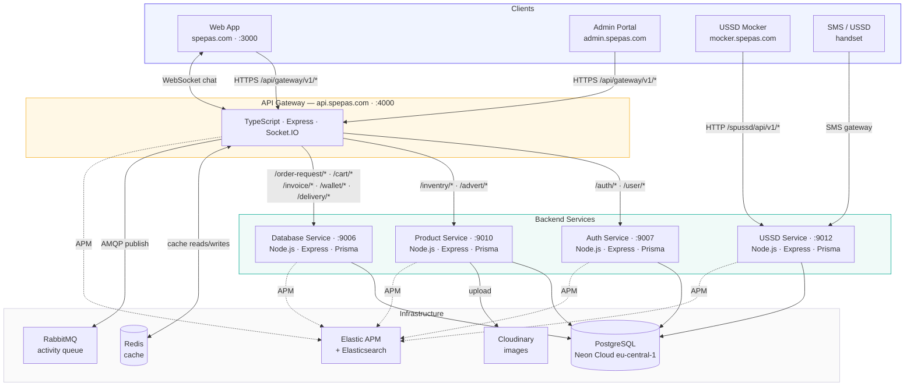
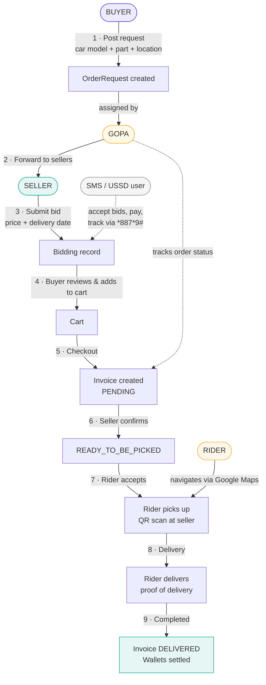

# SpePas Platform — Architecture Overview

> Last updated: 2026-02-22

---

## 1. Platform Summary

SpePas is a **microservices-based B2B2C marketplace for automotive spare parts** operating in West Africa. Buyers post spare-part requests, sellers submit bids, GOPA agents coordinate assignments, and riders handle last-mile delivery. The platform is accessible via a React web app and via SMS/USSD for lower-connectivity regions.

---

## 2. Service Map



---

## 3. Services

### 3.1 API Gateway
**Repo:** `gateway` | **Port:** 4000 | **Stack:** TypeScript + Express + Socket.IO

The single entry point for all client traffic. It:
- Authenticates requests (cookie-based JWT stored in `req.session.jwt`)
- Proxies to downstream services via named Axios instances
- Manages real-time chat via Socket.IO
- Publishes user activity events to RabbitMQ asynchronously
- Enforces rate limiting (100–150 req / 15 min per IP) and security headers

**Route → downstream mapping:**

| Gateway path | Downstream |
|---|---|
| `/api/gateway/v1/auth/*` | Auth Service :9007 |
| `/api/gateway/v1/inventry/*` | Product Service :9010 |
| `/api/gateway/v1/advert/*` | Product Service :9010 |
| `/api/gateway/v1/order-request/*` | Database Service :9006 |
| `/api/gateway/v1/bidding/*` | Database Service :9006 |
| `/api/gateway/v1/cart/*` | Database Service :9006 |
| `/api/gateway/v1/invoice/*` | Database Service :9006 |
| `/api/gateway/v1/delivery/*` | Database Service :9006 |
| `/api/gateway/v1/wallet/*` | Database Service :9006 |
| `/api/gateway/v1/user/*` | Auth Service :9007 |
| `/api/gateway/v1/chat/*` | Chat Service |
| `/api/gateway/v1/activity/*` | User Activity Service |

**Token flow:**
```
Client cookie → Gateway session → session_token / refresh_token headers → Downstream
```

**Infrastructure integrations:** Redis (caching), RabbitMQ (activity queue), Cloudinary (image uploads), Elasticsearch APM.

---

### 3.2 Auth Service
**Repo:** `spauthservices` | **Port:** 9007 | **Stack:** Node.js + Express + Prisma + bcryptjs

Handles all identity operations:
- User registration (all roles), login, OTP activation, password flows
- JWT generation and refresh token management
- RBAC: roles, permissions, groups, applications
- Returns user object + JWT to gateway on successful auth

**Key endpoints (base `/spauthservices/api/v1/`):**
- `POST /user/register`, `/user/login`, `/user/activate`
- `POST /user/forgot-password`, `/user/change-password`
- `GET /user/refresh-token`
- `GET /user/all-{buyers,sellers,gopas,mepas,riders}`
- `POST /role/add`, `/permission/add`, `/group/create`

---

### 3.3 Product Service
**Repo:** `spproductservices` | **Port:** 9010 | **Stack:** Node.js + Express + Prisma + Multer

Owns the spare-parts catalog:
- Car hierarchy: Manufacturer → Brand (model line) → Model (variant)
- Spare parts: listing, image upload (Multer), detail lookup by code
- Categories (hierarchical with parent/child)
- Ad sliders management

**Key endpoints (base `/spproductservices/api/v1/`):**
- `GET /manufacturer/all`, `POST /manufacturer/add`
- `GET /brand/all`, `GET /model/all`
- `GET /spare-part/all`, `GET /spare-part/details-by-code/:code`
- `POST /spare-part/add`, `POST /spare-part/upload-image`
- `POST /category/add`, `POST /slider/add`

---

### 3.4 Database Service
**Repo:** `spdatabaseservices` | **Port:** 9006 | **Stack:** Node.js + Express + Prisma + pg

The **source of truth for the Prisma schema** — all other services use a Prisma client generated from this schema. Handles everything that isn't auth or product catalog: orders, bids, cart, invoices, delivery, wallets, addresses.

See section 5 for the full schema.

---

### 3.5 USSD Service
**Repo:** `spussd` | **Port:** 9012 | **Stack:** Node.js + Express + Prisma

Implements a **state-machine USSD session flow** accessible both from SMS gateways and directly over HTTP. USSD shortcode: `*887*9#`.

**CORS allow-list includes `mocker.spepas.com`** — the USSD mocker UI calls this service directly.

**Channel rules:** Requests are created by phone (call-in to agent) or on the website — not via USSD. USSD is used to accept bids, make payments, and track orders.

**Role-specific endpoints (base `/spussd/api/v1/`):**
- `POST /base` — Buyer entry (My requests, Cart → Check Out, Contact us)
- `POST /base/seller` — Seller entry (Open Requests → All/By part/By brand, My bids)
- `POST /base/rider` — Rider entry (New pickups, In progress, Completed, Wallet → Withdraw)

**Flow groups:**
- Buyer flows: `/request/*`, `/bidding/*`, `/cart/*`
- Seller flows: `/seller/request/*`, `/seller/bid/*`
- Rider flows: `/rider/pickup/*`, `/rider/delivery/*`, `/rider/completed/*`, `/rider/wallet/*`

---

### 3.6 USSD Mocker
**Repo:** `spepas-ussd-mocker` | **Port:** 5173 (Vite) | **Stack:** React 19 + TypeScript + Tailwind v4

A web UI that simulates a USSD handset session. Calls the USSD Service directly at `https://ussd.spepas.com`. Used for QA and development — deployed to `mocker.spepas.com`.

---

### 3.7 Frontend — SpePas Website
**Repo:** `spepas-website` | **Port:** 3000 (dev) | **Stack:** React 19 + TypeScript + Vite 6 + Tailwind v4

See sections 6–10 for the full frontend breakdown.

---

### 3.8 Admin Portal
**Repo:** `spepas-web-admin` | **URL:** `admin.spepas.com` | **Stack:** React SPA

The back-office management tool for platform administration and phone order agent workspace. Authenticates via `api.spepas.com` using cookie-based sessions (same gateway as the web app).

**Key modules:**
- **Access Management:** Permissions, Roles, Applications, Menus, Groups
- **User Management:** Admin users, Sellers, Buyers, Riders, Mepa, Gopa (with Google Maps integration)
- **Call-In Order Management:** 4-step phone order wizard (Search Customer → Confirm Buyer → Order Details → Review & Submit)
- **Order Management:** Active Requests, Spare Parts Orders, Gopa Orders, Seller Orders
- **Wallet Management:** Platform wallets (revenue + suspense)
- **Inventory Management:** Categories, Manufacturers, Brands, Models, Spare Parts
- **Settings:** Profile, Security

See [Admin Portal PRD](prd/admin-portal-prd.md) for full details.

---

## 4. Infrastructure

| Component | Technology | Purpose |
|---|---|---|
| Database | PostgreSQL on Neon Cloud (eu-central-1) | All persistent data |
| Cache | Redis (ioredis) | Gateway caching |
| Message queue | RabbitMQ (amqplib) | Async user activity logging |
| Real-time | Socket.IO on gateway | Chat, live notifications |
| Image hosting | Cloudinary | Spare part / profile images |
| Monitoring | Elastic APM + Elasticsearch | Tracing, logging (all services) |
| Containers | Docker (per service) + docker-compose | Local dev & deployment |
| CI/CD | Jenkins (Jenkinsfile in each repo) | Build pipeline |

**Production hosts:**
- `spepas.com` — Frontend
- `api.spepas.com` — Gateway (port 4000)
- `ussd.spepas.com` — USSD Service
- `mocker.spepas.com` — USSD Mocker UI
- `admin.spepas.com` — Admin portal

**Ports (local dev):**

| Service | Port |
|---|---|
| Frontend (Vite) | 3000 |
| Gateway | 4000 |
| Database Service | 9006 |
| Auth Service | 9007 |
| Product Service | 9010 |
| USSD Service | 9012 |

---

## 5. Database Schema (Prisma)

All services share a single PostgreSQL database (`spepasdb`) defined in `spdatabaseservices/prisma/schema.prisma`.

### User & Identity

| Model | Key fields |
|---|---|
| `User` | `User_ID` (UUID), `email`, `password` (bcrypt), `user_type`, `status`, `phone_number` |
| `Administrator` | Admin flag linked to User |
| `UserRole` | User → Role mapping |
| `Role` | ADMIN, SELLER, DELIVERY, BUYER, GOPA, MEPA |
| `Permission` | Fine-grained permission definitions |
| `RolePermission` | Role → Permission mapping |
| `Group` | User groups |
| `Application` | Platform sub-applications |
| `UserIdentification` | ID docs: NATIONAL, PASSPORT, DRIVERS, VOTERS |
| `OTPManager` | OTP tokens with expiry counter (SECOND, MINUTE, HOUR) |
| `PaymentAccount` | BANK_ACCOUNT, WALLET, PAYPAL per user |

### Role Profiles

| Model | Key fields |
|---|---|
| `Gopa` | `Gopa_ID`, `specialties`, `commissions`, `status` |
| `Seller` | `Seller_ID`, `storeName`, `Location` (geo JSON), `commissions` |
| `Mepa` | `Mepa_ID`, `shop_name`, `address`, `location` (geo JSON) |
| `Deliver` | `Deliver_ID`, `licenseNumber`, vehicles[], `commissions` |
| `DeliverVehicle` | MOTOR, CAR, TRUCK, BICYCLE |

### Product Catalog

| Model | Key fields |
|---|---|
| `Manufacturer` | `Manufacturer_ID`, `name`, `country`, external TecDoc ID |
| `CarBrand` | `CarBrand_ID`, `name`, `type`, `manufacturer_ID` |
| `CarModel` | `CarModel_ID`, `name`, `yearOfMake`, `carBrand_ID` |
| `Category` | `Category_ID`, `name`, `parent_ID` (self-referential) |
| `SparePart` | `SparePart_ID`, `name`, `description`, `price`, `status`, images[], `carModel_ID`, `seller_ID` |
| `SparePartImage` | `image_ID`, `image_url`, `SparePart_ID` |
| `Discount` | Discount codes linked to spare parts |
| `Review` | Unique per user × spare part |
| `Wishlist` | User wishlists |

### Marketplace Flow

| Model | Key fields |
|---|---|
| `OrderRequest` | `OrderRequest_ID`, `quantity`, `status`, images[], buyer & car info |
| `Bidding` | `Bidding_ID`, `price`, `delivery_date`, images[], `status` |
| `Cart` | `Cart_ID`, linked to `Bidding`, `User` |
| `Invoice` | `Invoice_ID`, totals, charges, payment info, QR code, `gopa_accepted_status` |
| `Invoice_Item` | Per-cart item in an invoice, with rider acceptance status |
| `Invoice_Item_Tracker` | Audit trail of status changes per invoice item |
| `Delivery` | Physical delivery record with QR-code tracking |

**Invoice status lifecycle:**
```
PENDING → RECEIVED → WARE_HOUSE → READY_TO_BE_SHIPPED
    → READY_TO_BE_PICKED → SHIPPED → DELIVERED
    → (CANCELLED | FAILED)
```

### Financial

| Model | Key fields |
|---|---|
| `Wallet` | USER, REVENUE, DEBIT_SUSPENSE, CREDIT_SUSPENSE |
| `Transaction` | Debit/credit entries, `externalRef`, narration |
| `ServiceCharges` | DELIVERY_CHARGE, SERVICE_CHARGE, GOPA_CHARGE, TAX |
| `Commission` | Per-role commission tracking |

### Other

| Model | Purpose |
|---|---|
| `userAddress` | Buyer/seller addresses with JSON geo data |
| `SliderImages` | Homepage ad carousel entries |
| `Advertisement` | Ad placements |

---

## 6. Frontend Tech Stack

| Layer | Technology |
|---|---|
| Framework | React 19 + TypeScript 5.7 |
| Routing | React Router v7.4 |
| State | React Context + TanStack React Query v5 |
| HTTP | Axios (cookie-based, `withCredentials: true`) |
| Forms | React Hook Form + Zod |
| UI | Radix UI (headless) + Tailwind CSS v4 |
| Icons | Heroicons, Lucide, Hugeicons |
| Maps | Google Maps API + Leaflet |
| Animations | Framer Motion + Lottie |
| Build | Vite 6 |
| Package mgr | pnpm |
| Monitoring | Elastic APM (RUM) |
| Deployment | Docker + nginx |

---

## 7. Frontend Project Structure

```
spepas-website/
├── src/
│   ├── components/
│   │   ├── Auth/           # Login, signup, OTP forms
│   │   ├── buyer/          # Buyer-facing pages
│   │   ├── seller/         # Seller-facing pages
│   │   ├── gopa/           # GOPA agent pages
│   │   ├── gopaInvoices/   # Invoice management
│   │   ├── rider/          # Rider/delivery pages
│   │   ├── chat/           # Messaging widget
│   │   ├── profiling/      # Role onboarding forms
│   │   ├── layout/         # Layout shells
│   │   ├── marketing/      # Public site (home, shop, footer)
│   │   └── common/         # Shared components
│   ├── config/             # App, API, route, env configs
│   ├── features/
│   │   ├── auth/           # AuthProvider + useAuth
│   │   └── accountTypeContext.tsx  # Active-role context
│   ├── hooks/              # Custom React hooks
│   ├── lib/                # Axios client, API functions, Zod schemas
│   ├── pages/              # One file per route
│   ├── routes/             # Route definitions per role
│   └── index.css           # Tailwind @theme tokens
├── docs/
├── public/
├── vite-plugin-local-inventory.ts  # Dev mock for inventory API
├── Dockerfile
└── nginx.conf
```

---

## 8. Frontend Routing

Base path: `/95668339501103956045` (unique namespace, separates app from landing page)

```
/                            → Landing page (MarketingLayout)
/95668339501103956045/
  ├── (MarketingLayout)      → Public site
  │   ├── /home
  │   ├── /shop              → Spare parts catalogue (calls Product Service)
  │   ├── /shop/:id          → Part detail page
  │   ├── /about-us, /faqs, /contact, /privacy-policy, /refund-policy, /terms
  │   └── (ProtectedLayout)  → Requires authentication
  │       ├── /my-account
  │       ├── /profiling/*   → Role onboarding
  │       ├── /buyer/*       → Post requests, cart, checkout, orders
  │       ├── /seller/*      → Bid management
  │       ├── /gopa/*        → Request assignment
  │       ├── /gopa-invoices/*
  │       ├── /rider/*       → Pickup & delivery (with maps)
  │       └── /chat/*
  └── /auth/                 → AuthLayout (no header/footer)
      ├── /signin, /signup, /activate
      ├── /forgot-password, /reset-password, /change-password
      └── /profile-switch-otp
```

---

## 9. User Roles

| Role | Description |
|---|---|
| **BUYER** | Posts spare-part requests, reviews bids, places orders |
| **SELLER** | Bids on buyer requests, manages inventory |
| **GOPA** | Group Purchasing Agent — onboards sellers, forwards requests to sellers, tracks forwarded orders |
| **MEPA** | Market Entry Point Aggregator — secondary marketplace actor |
| **RIDER** | Delivery personnel — GPS-guided pickup and drop-off with QR scanning |
| **ADMIN** | Platform administration |

One user account can hold multiple roles. The `AccountTypeProvider` tracks the active role and persists it to `localStorage`. Role switching requires OTP verification.

---

## 10. Authentication

**Strategy: HTTP-only cookie sessions managed by the gateway**

```
User submits credentials
    ↓ POST /api/gateway/v1/auth/signin
Gateway → Auth Service (validates password, returns JWT)
Gateway stores JWT in req.session.jwt (cookie)
Gateway returns user object to frontend
    ↓
Frontend stores user object in:
  - React Context (in-memory)
  - localStorage (persistence across refreshes)
All requests include session cookie automatically (withCredentials: true)
401 response → clear auth state → redirect to /auth/signin
```

- No JWT tokens on the client — cookie only
- 2-hour inactivity auto-logout (mousemove, keypress, scroll, touch events)
- Token refresh endpoint: `/auth/refresh`
- Role-switch requires OTP re-verification

---

## 11. Frontend API Layer

**HTTP client:** Axios (`src/lib/axios.ts`)
- Dev: Vite proxy `/api` → `https://api.spepas.com/api/gateway/v1`
- Prod: `VITE_API_URL` direct

**API modules in `src/lib/`:**

| Module | Endpoints used |
|---|---|
| `auth.ts` | `/auth/*` |
| `inventoryApis.ts` | `/inventry/*` (spare parts, categories, car hierarchy) |
| `orderBidsApis.ts` | `/order-request/*`, `/bidding/*`, `/cart/*` |
| `profiling.ts` | `/user/*` (create GOPA, Seller, MEPA, Rider profiles) |
| `addressApis.ts` | `/user/address/*` |
| `otpApis.ts` | `/auth/otp/*` |
| `walletApis.ts` | `/wallet/*` |
| `gopaInvoiceApis.ts` | `/invoice/*` |

Every module validates responses with a Zod schema before returning data to the UI.

---

## 12. Core User Flows



### Buyer
1. Post spare-part request (car model + part details + location)
2. Receive bids from sellers
3. Review bids, add to cart
4. Checkout → select address → confirm payment → Invoice created
5. Track order via rider (map + status updates)

### Seller
1. View requests assigned by GOPA
2. Submit bid (price + delivery date + images)
3. Mark items ready for pickup when order confirmed
4. Manage bid history

### GOPA
1. Onboard new sellers into network
2. View unassigned buyer requests
3. Forward requests to specific sellers
4. Track forwarded order statuses

### Rider
1. View available pickups (invoice items ready for pickup)
2. Accept → navigate to seller (Google Maps)
3. Scan QR code at seller location
4. Navigate to buyer address
5. Deliver + upload proof of delivery
6. Wallet credited on completion

### USSD (low-connectivity)
Shortcode `*887*9#`. Accessible from any mobile phone, no data/app required. Navigated as sequential numbered menus. **Requests are created by phone call-in or website only** — USSD is used to accept bids, pay, and track orders. Mockers at `mocker.spepas.com` (buyer `/`, seller `/seller`, rider `/rider`).

---

## 13. Key Integrations

| Integration | Usage |
|---|---|
| Google Maps API | Rider navigation (pickup → delivery) |
| Leaflet | Map picker for address/location setup |
| Cloudinary | Spare part and profile image hosting |
| Socket.IO | Real-time chat (buyer ↔ seller, rider ↔ buyer) |
| RabbitMQ | Async user-activity event logging |
| Redis | Gateway-level caching |
| Elastic APM | Full-stack tracing and performance monitoring |
| Elasticsearch | Centralised log aggregation |
| Jenkins | CI/CD pipelines (Jenkinsfile in every repo) |

---

## 14. Build & Deployment

### Frontend
```bash
pnpm dev      # Vite dev server :3000, proxies /api/* to VITE_API_URL
pnpm build    # tsc + vite build → ./build/
```
Deployed as Docker + nginx. `nginx.conf` serves SPA with `try_files $uri /index.html` fallback.

### Backend services
Each service has a `Dockerfile` and `docker-compose.yaml`. Docker images published as e.g. `jboadi/spepas-gateway:stable`, `matkofbass/spdbservice:stable`.

### Environment variables (frontend `.env`)
```
VITE_API_URL=https://api.spepas.com/api/gateway/v1
VITE_PROXY_BASE_URL=api
VITE_ELASTIC_APM_SERVER=https://apm.spepas.com
VITE_USE_LOCAL_DATA=false   # set true in .env.local to use local SQLite mock
```

---

## 15. Local Development — Inventory Mock

When the live API is unavailable, the frontend can serve inventory data from a local SQLite database built from TecDoc CSV exports.

```bash
# First-time setup
pnpm install
pnpm local-data:import          # full import (~3–5 min)
# or: pnpm local-data:import:quick  (first 500 vehicles, ~30 sec)

# Enable in .env.local
VITE_USE_LOCAL_DATA=true

pnpm dev  # Vite intercepts /inventry/* before proxying to live API
```

The Vite plugin (`vite-plugin-local-inventory.ts`) intercepts all five inventory endpoints and returns SQLite-backed data that matches the live API's Zod schemas exactly, including nested `carModel → carBrand → manufacturer` for client-side filtering.

---

## 16. Code Conventions (Frontend)

- **Path alias:** `@/` → `src/`
- **Imports:** Auto-sorted via `eslint-plugin-simple-import-sort`
- **Components:** PascalCase, one per file
- **API calls:** Zod-validated response, wrapped in React Query at page level
- **Forms:** React Hook Form; no uncontrolled inputs for user-facing forms
- **Styling:** Tailwind utilities; variants via CVA; class merging via `tailwind-merge`
- **Fonts:** Plus Jakarta Sans (brand spec — migration from Poppins in progress)

---

## 17. Known Issues & Notes

- **Shared database:** All microservices write to the same PostgreSQL instance via Prisma. Good for consistency, limits independent scaling.
- **Typos in production code:** Route path `/spdatbaseservice/` (missing `a`), enum `VIHICLE_TYPE`, variable `ordder` — these are in the backend repos.
- **Kafka configured but unused:** `kafkajs` is installed in the gateway; queues are not actively used.
- **`ENABLE_APM=0` default:** APM is installed everywhere but disabled by default; set to `1` to activate.
- **Frontend manufacturer/brand/model filters:** Require `carModel` nested data on spare parts. The local mock provides this; the live API may strip it (Zod schema updated to preserve it if present).
