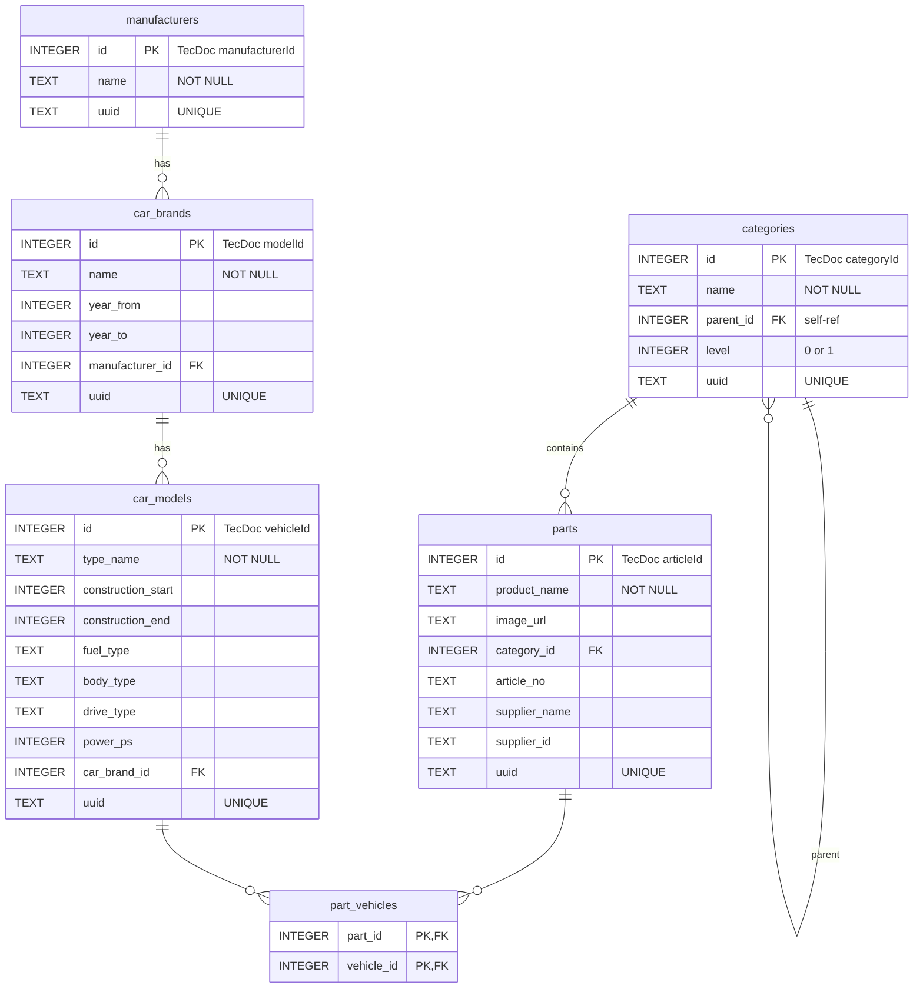

# Inventory Database Schema

SQLite database (`inventory.db`) containing the TecDoc-sourced parts catalog.

## Entity-Relationship Diagram

## Row Counts

| Table          | Rows        |
|----------------|-------------|
| manufacturers  | 10          |
| car_brands     | 1,065       |
| car_models     | 11,184      |
| categories     | 1,323       |
| parts          | 337,293     |
| part_vehicles  | 12,628,694  |

## Indexes

| Index                      | Table          | Column(s)          |
|----------------------------|----------------|--------------------|
| idx_pv_part_id             | part_vehicles  | part_id            |
| idx_pv_vehicle_id          | part_vehicles  | vehicle_id         |
| idx_parts_category_id      | parts          | category_id        |
| idx_parts_product_name     | parts          | product_name       |
| idx_car_models_brand       | car_models     | car_brand_id       |
| idx_car_brands_mfr         | car_brands     | manufacturer_id    |
| idx_car_models_year        | car_models     | construction_start |

## Notes

- **Primary keys** are TecDoc IDs (not autoincrement) for direct cross-referencing with source CSVs
- **Import rules**: see `IMPORT-RULES.md` for filtering logic
- **Source**: TecDoc automotive parts catalog (10 retained manufacturers)
- **part_vehicles** is the junction table for the many-to-many between parts and car_models (~12.6M associations)
- **categories** uses a 2-level adjacency list (top-level `level=0`, children `level=1`)
- All domain tables carry a `uuid` column for external API correlation
